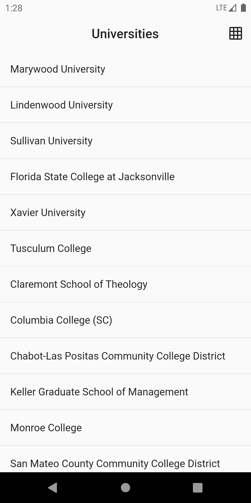
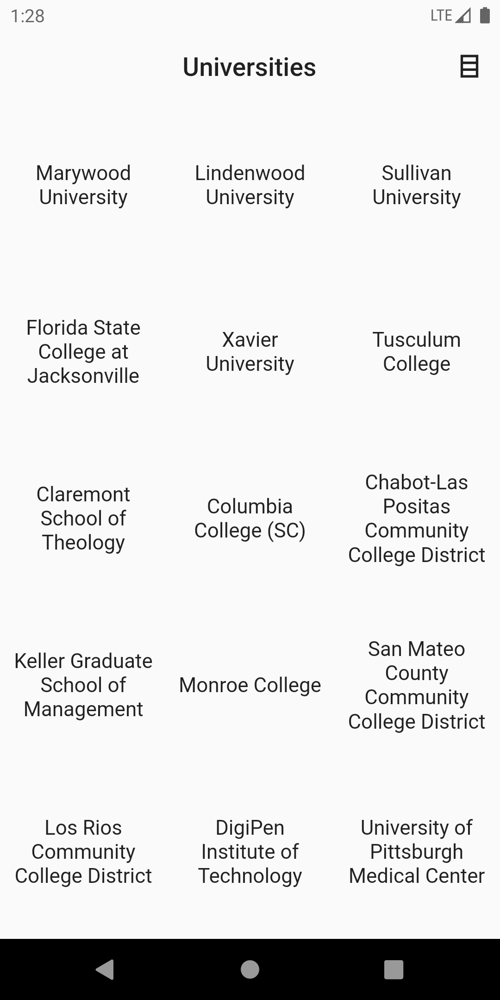
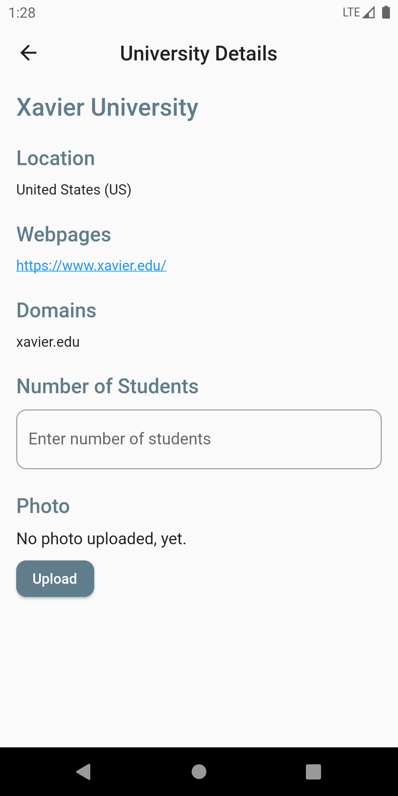
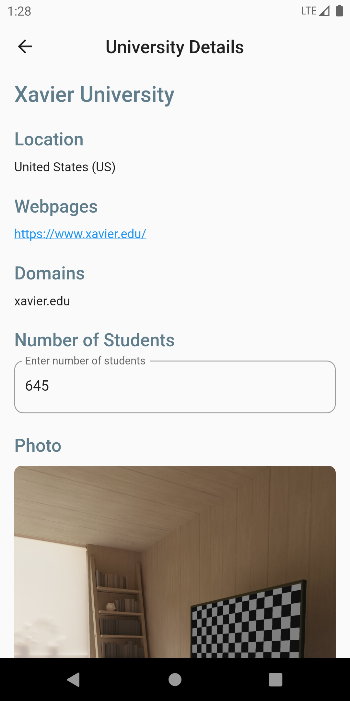

# Frontend Test

This app fulfills all requested requirements, even the bonus one.
Package used to fetch data from given endpoint was **Dio** (even though it had a simple use case).
Package used to manage state was **BLoC**.

App is completely setup to run on Android only, due to time restrictions.

## Screenshots
 
 

## Demo

